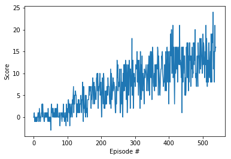

# Report

The learnign algorithm is the deep Q-learning with experience replay (DQN) presented in 
[ Mnih et al. 2015](https://storage.googleapis.com/deepmind-media/dqn/DQNNaturePaper.pdf) 

Compared to the original, that used images as input to solve Atari games, the current algorithm has a state vector with 37 dimensions as input, 
so we replaced a convolutional layer with a linear layer.

The neural network used to approximate the action-value function Q has 3 fully connected layers respectively with input/output dimensions of 
37/64, 64/64, 64/4. The network uses ReLUs as activation functions.

We tried also larger networks but they underperformed compared to the reported choice.

Additional hyperparameter choice:

BUFFER_SIZE = int(1e5)  # replay buffer size.   
BATCH_SIZE = 64         # minibatch size.   
GAMMA = 0.99            # discount factor.   
TAU = 1e-3              # for soft update of target parameters.   
LR = 5e-4               # learning rate.       
UPDATE_EVERY = 4        # how often to update the network.     
eps_start=1.0           # starting epsilon.   
eps_end=0.01            # ending epsilon.   
eps_decay=0.995         # epsilon decay.     

   
The plot of the scores shows the learning of the algorithm.  
The agent solved the environment in 440 episodes, with an average score over the last 100 episodes of 13.07.  
Continuing to train the same agent for longer it plateaud at an average of around 16 from 800 episodes up to 2000.

## Future work
Possible improvements include
* Double DQN (DDQN)
* Prioritized experience replay
* Dueling DQN
* Learning from multi-step bootstrap targets
* Distributional DQN
* Noisy DQN
* Rainbow (a combination of all of the above)
Another option would be to train the agent to learn directly from pixels.
